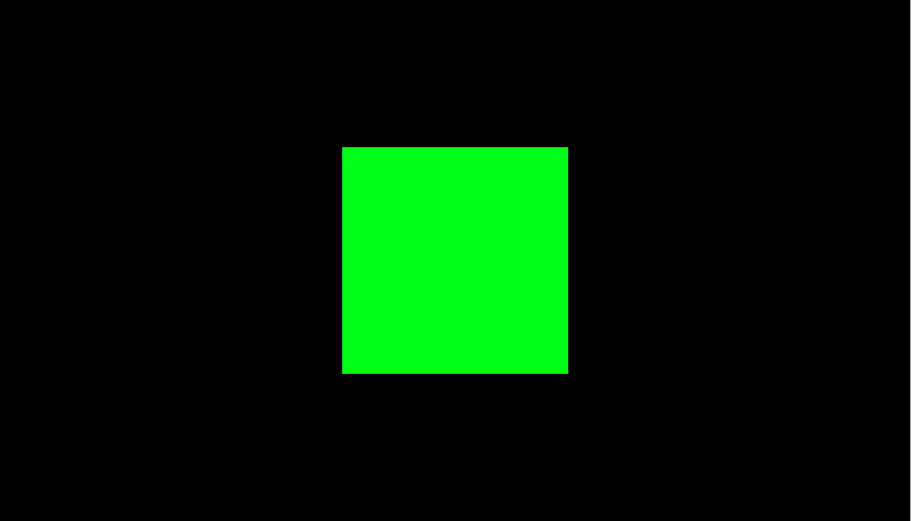

# Activity 1: Getting Started - Creating your first 3D website!

## Activity Example
- [Activity 1: Getting Started](../activities/activity1.html)

_This activity is adapted from the [official three.js quickstart](https://threejs.org/docs/index.html#manual/en/introduction/Creating-a-scene)._

Let's build your very first 3D using WebGL! We'll use the `three.js` library which wraps many of the WebGL components into a more beginner friendly format. We've included this library in the `activites\js` folder for your convenience.

To get started, create a new `.html` file in the `activities` directory with the following content. You'll notice that the `<body>` imports the `three.js` library and opens a new, empty script for the code that will create the 3D objects on your website.
```html
<!DOCTYPE html>
<html>
	<head>
		<meta charset="utf-8">
		<title>My first 3D website with three.js!</title>
		<style>
			body { margin: 0; }
		</style>
	</head>
	<body>
		<script src="js/three.js"></script>
		<script>
            // TODO - your 3D scene code will go here.
		</script>
	</body>
</html>
```
_NOTE: To load this website you will need a web server. We recommend using [VS Code](https://code.visualstudio.com/) with this tutorial because it has a really easy to use [Live Server Extension](https://marketplace.visualstudio.com/items?itemName=ritwickdey.LiveServer). 
Once it's installed, all you have to do is right click your `.html` file and choose the option **Open with Live Server**.
Not only will your web page open in the browser, any changes you make to the source file are immediately reflected in the browser.
Other IDEs may also have a similar feature that you can use._

Any website that wants to show 3D objects needs three fundamental components: a Scene, a Camera, and a Renderer.
A Scene is the canvas, or area, in which the 3D objects will be created in. 
A Camera is a view of those objects that the user will have. 
The Renderer is what will create those objects to be displayed to the user.

A Camera will have 4 attributes that we can define: the field of view, the aspect ratio, the near clipping pane, and the far clipping pane. 
The field of view describes how much of the Scene is displayed to the user at any given time, measured in degrees.
The aspect ratio ensures that the 3D objects are displayed correctly on the user's screen. 
It's recommended to use a ratio of the width of an element (such as the browser Window) divided by the height of that element. 
Lastly, the near and far clipping panes indicate the distance away from the camera in which other objects will not render.

After creating the Renderer object, it is important to set the size in which you want to render your 3D objects. 
It's recommended to set the rendering size as the size you want your application to fill.
 

```javascript
// Create the scene to hold the 3D objects
const scene = new THREE.Scene();

// Create the camera to view the 3D objects
const camera = new THREE.PerspectiveCamera(
    75,                                     // Frame of view
    window.innerWidth / window.innerHeight, // Aspect ratio
    0.1,                                    // Near clipping plane
    1000                                    // Far clipping plane
);

// Create the renderer to draw the 3D objects in the browser.
const renderer = new THREE.WebGLRenderer();
renderer.setSize( window.innerWidth, window.innerHeight );

// Add the drawn scene to the browser window
document.body.appendChild( renderer.domElement );
```

If you open your HTML file in a browser, you should now see a perfectly black screen representing your empty Scene.
While this is _technically_ a 3D website, it is not particularly interesting, so let's add some basic 3D objects to it.

In `three.js`, 3D objects consist of three layers: a `Geometry`, a `Material`, and a `Mesh`. 
An object's `Geometry` is simply a mathematical representation of its underlying shape.
The visual parts of the object are defined by a `Material` which is linked to a specific `Geometry` via the creation of a `Mesh` which can be rendered on the screen.

With that background knowledge in place, let's create our first 3D object, a cube!
To do this we will create a `BoxGeometry` with the default parameters to create the mathematical representation of a cube. We will then create a `MeshBasicMaterial` of a solid color to visualize the cube (here we've chosen hacker green). Then finally we tie those two components into an overall `Mesh` that we can add to the Scene.

We'll also move the camera out from the middle of the cube, set the background color of the Scene to a dark contrast, and render it all out to the screen.

Go ahead and add the following block of code to the end of your `<script>` to accomplish all of this.
```javascript
// Create the Geometry (i.e. mathematical representation) of the 3D cube
const geometry = new THREE.BoxGeometry();

// Create the Material (i.e. the visual information) for the 3D cube
// Feel free to change the `color` to the hex-code of your favorite color!
const material = new THREE.MeshBasicMaterial( { color: 0x00ff00 } );

// Tie the Geometry and Material together with a Mesh
const cube = new THREE.Mesh( geometry, material );

// Add the Mesh to the Scene
scene.add( cube );


// Back up the camera so the cube is within the camera's view
camera.position.z = 2;
// Change the background color of the scene
scene.background = new THREE.Color( 0xacfabf );
// Redraw the scene on the browser window to see the 3D cube
renderer.render( scene, camera );
```

If you've done it correctly, you should see a green square in the middle of your browser window like this (unless you customized the color to something else).


This is a neat improvement, but we're still looking at a screen that could have been made with standard CSS.
To start to show the power of WebGL, let's animate the cube!
We will use a function called `requestAnimationFrame` along with our Renderer to draw our cube every time the browser automatically refreshes
the Window (which is typically 60 times per second).
With this constant, automatic, and rapid refreshing and redrawing, we will make our cube appear to rotate!

To make our cube rotate, we will adjust a property called `rotation`. 
For this example, we will adjust both the x-axis and y-axis rotation of the cube.

```javascript
function animate() {
  // Set up the recurring call that powers the animation loop
  requestAnimationFrame( animate );

  // Change the rotation of the cube for one frame of animation
  cube.rotation.x += 0.01;
  cube.rotation.y += 0.01;

  // Redraw the scene in the browser window
  renderer.render( scene, camera );
}

// Start the animation loop
animate();
```

The animate loop can call other functions within it as well. So for this example, we could also write the above block of code as follows:

```javascript
function rotateCube() {
  // Change the rotation of the cube for one frame of animation
  cube.rotation.x += 0.01;
  cube.rotation.y += 0.01;
}

function animate() {
  // Set up a recurring call to animate
  requestAnimationFrame( animate );

  // Call the function(s) that will change our 3D objects
  rotateCube();
  
  // Redraw the scene in the browser window
  renderer.render( scene, camera );
}

// Start the animation loop
animate();
```

If everything has been done correctly, then the cube rotates in your 3D website as shown below!


If you're having trouble, feel free to compare your code with the example solution contained in [`activity1.html`](../activities/activity1.html).

When you're ready, go ahead and move on to [Activity 2](./activity2.md)!

### Applicable Learning Outcomes:
#### Learning Outcome 1: Geometries and Meshes
The student will be able to use THREE.js to draw basic 3D objects in a web browser.

