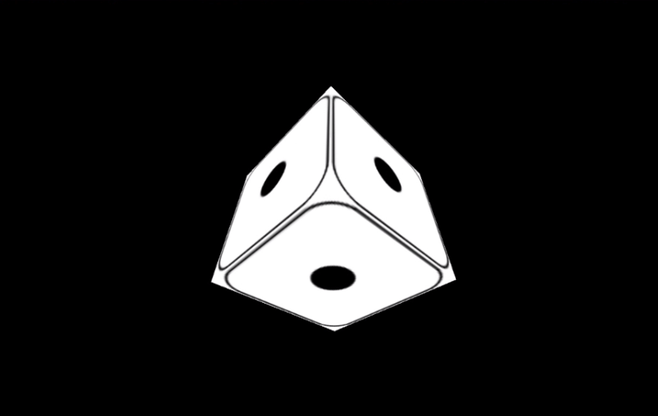

# Activity 2: Textures - Adding Custom Images to 3D Objects
_Pre-requisites: Activity 1_

## Activity Example
- [Activity 2: Textures](../activities/activity2.html)

At this point, we have a great start in object drawing and animation!
Now let's learn how to use a `Texture` to put custom images onto the sides of our cube.
In this tutorial we'll turn our cube into a die. All required images have been provided in the `activities/img` folder. Feel free to change them to some other image you wish to show on the sides of your cube.

In the code below, we have overwritten the `material` variable created in the last activity to instead load the image of the single black dot of a die from the `activites/img` folder and apply it to all sides of our cube. 
Notice how we are still using the same `MeshBasicMaterial` object shown in the last activity, but instead of setting a `color` for the Material, we are instead configuring a color `map` with the contents of the image loaded from disk.

```javascript
const material = new THREE.MeshBasicMaterial(
  { map: new THREE.TextureLoader().load('./img/side_1.png') }
);
```

Adding this material during the creation of the cube will result in the image being displayed on each side of the cube.



However, no useful die has the same number of dots on each side.
In order to customize which image is shown on each side of the cube, we need to upgrade from our `MeshBasicMaterial` to a `MeshFaceMaterial`.

In the code example below, we again overwrite the `material` variable, this time with a `MeshFaceMaterial` that takes an array of six `MeshBasicMaterial`s, one for each side of the cube, each loading a separate image for its respective side.

```javascript
// NEW: Create the texture for the material
// Note: The images are loaded in this order to match the position of the numbers on a die.
const material = new THREE.MeshFaceMaterial([
  new THREE.MeshBasicMaterial( { map: THREE.ImageUtils.loadTexture('img/side_1.png') } ),
  new THREE.MeshBasicMaterial( { map: THREE.ImageUtils.loadTexture('img/side_6.png') } ),
  new THREE.MeshBasicMaterial( { map: THREE.ImageUtils.loadTexture('img/side_2.png') } ),
  new THREE.MeshBasicMaterial( { map: THREE.ImageUtils.loadTexture('img/side_5.png') } ),
  new THREE.MeshBasicMaterial( { map: THREE.ImageUtils.loadTexture('img/side_3.png') } ),
  new THREE.MeshBasicMaterial( { map: THREE.ImageUtils.loadTexture('img/side_4.png') } ),
]);
```

If everything was done correctly, we should now see an animated cube with an accurately filled die, attached to all sides of the animated cube.

If you're having trouble, feel free to compare your code with the example solution contained in [`activity2.html`](../activities/activity2.html).

When you're ready, go ahead and move on to [Activity 3](./activity3.md)!

### Applicable Learning Outcomes:
#### Learning Outcome 1: Geometries and Meshes
The student will be able to use THREE.js to draw basic 3D objects in a web browser.
#### Learning Outcome 2: Textures
The student will be able to use THREE.js to add color and images to 3D objects.
#### Learning Outcome 3: Animation
The student will be able to create a basic render loop in THREE.js to create visible animations of 3D objects in the browser window.
