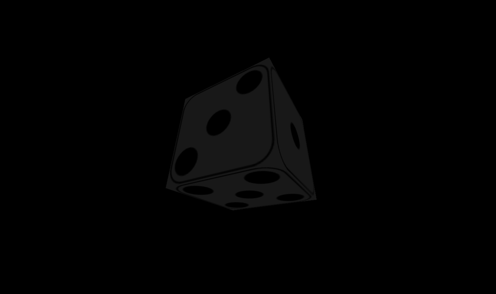
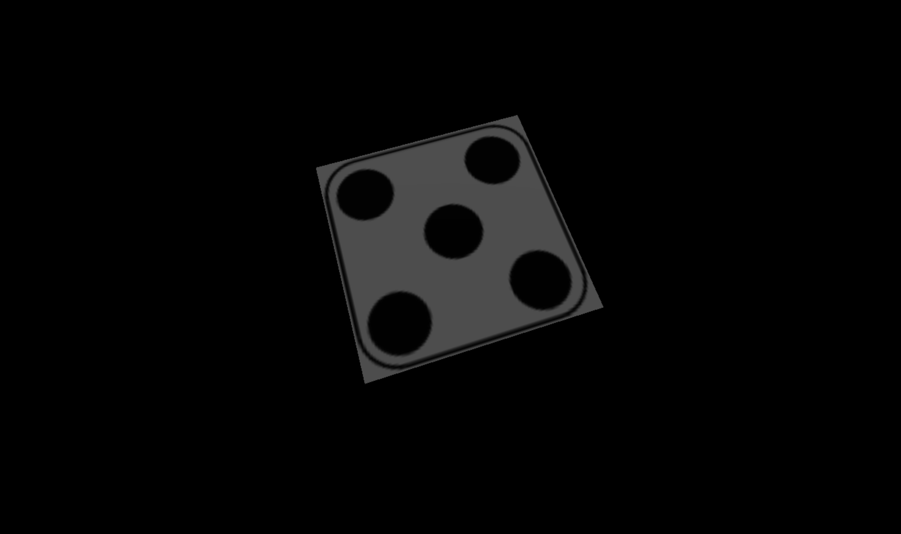

# Activity 3: Adding Lights to the Scene
_Pre-requisites: Activity 1 and Activity 2_

## Activity Example
- [Activity 3: Adding Lights to the Scene](../activities/activity3.html)

Now that we have added textures to our rotating cube, let's add a simple visual effect using `Light`.
`Light` is an abstract class in `three.js` that will serve as a base for several subclasses.

The `Light` class has two properties: `color` and `intensity`.
- The `color` property is a hexademical value of the color of the `Light`. 
Its default value is white (`0xffffff`).
- The `intensity` property is a decimal value of how strong the `Light` is.
Its default value is `1`.

The constructor for any `Light` will define the `color` first followed by the `intensity`.

This activity will demonstrate two different types of `Light`: 
`AmbientLight` and `DirectionalLight`.

#### AmbientLight
Let's start by using `AmbientLight` with our rotating die.
`AmbientLight` illuminates the entire Scene and affects all Objects in the Scene.
It essentially changes an Object's `color` based on the `AmbientLight`'s `color` and `intensity` values.
It can be compared to putting a color filter over the entire Scene.

Let's start by adding a gray `AmbientLight` to our Scene.
We will include these lines of code before we call our Renderer to render our Scene:

```javascript
// Create the AmbientLight
const ambientLight = new THREE.AmbientLight( 0x191919, 1);
scene.add( ambientLight );
```

When executing the rotating die application now, you may notice that the die does not appear gray at all.
This highlights an important detail about using `Light`:

**Some `Material` types do *not* work with `Light`**

**This is important to consider whenever you will be using `Light` in your Scenes!**

In the case of this example, the `MeshBasicMaterial` we used for the `Texture` for the sides of our die is not compatible with `Light`.
However, we can use `MeshStandardMaterial` instead to have a similar look for our die.
Editing our `Texture` code will result in the following:

```javascript
// NEW: Create the texture for the material based on custom images
// Note: The images are loaded in this order to match the position of the numbers on a die.
const material = new THREE.MeshFaceMaterial([
  new THREE.MeshStandardMaterial( { map: THREE.ImageUtils.loadTexture('img/side_1.png') } ),
  new THREE.MeshStandardMaterial( { map: THREE.ImageUtils.loadTexture('img/side_6.png') } ),
  new THREE.MeshStandardMaterial( { map: THREE.ImageUtils.loadTexture('img/side_2.png') } ),
  new THREE.MeshStandardMaterial( { map: THREE.ImageUtils.loadTexture('img/side_5.png') } ),
  new THREE.MeshStandardMaterial( { map: THREE.ImageUtils.loadTexture('img/side_3.png') } ),
  new THREE.MeshStandardMaterial( { map: THREE.ImageUtils.loadTexture('img/side_4.png') } ),
]);
```

If everything was done correctly the die should appear gray now!


Notice that the whole die appears gray; there is no shadow created by the `AmbientLight`.
For now, this is fine.

Let's move on to another type of `Light`: `DirectionalLight`.

#### DirectionalLight
`DirectionalLight` creates a plane of light that illuminates the Scene and its Objects.
It can be compared as being the sun in a Scene.

`DirectionalLight` Objects have two additional properties that we can adjust: `position` and `target`.
- The `position` property is an x, y, z coordinate that specifies where the `DirectionalLight` Object is.
The default value is `( 0, 1, 0 )` ( x: 0, y: 1, z: 0 ).
- The `target` property is an x, y, z coordinate *or* a 3D Object that specifies where the `DirectionalLight` Object is pointing to.
The default value is `( 0, 0, 0 )`.
  - When the `target` property is changed from the default, it must be added to the Scene as well.
  This is done like so: 
  ```javascript
  directionalLight.target.position.set( 1, 1, 1 );
  scene.add( directionalLight.target );`
  ```

To visualize `DirectionalLight`, let's comment out our `AmbientLight` code and create a `DirectionalLight` Object.
Let's set our `DirectionalLight` to be a white light.

```javascript
// Create the AmbientLight
//const ambientLight = new THREE.AmbientLight( 0x191919, 1);
//scene.add( ambientLight );

// Create the DirectionalLight
const directionalLight = new THREE.DirectionalLight( 0xffffff, 1);
scene.add( directionalLight );
```

If everything was done correctly, we will get a much different experience!


You should see that the sides of the die will appear before fading away to black.
However, this causes most of the die to not be seen from our viewpoint. 
For this activity, we will change the `position` of the `DirectionalLight` so it shows the front of the die better.

```javascript
// Create the AmbientLight
//const ambientLight = new THREE.AmbientLight( 0x444444, 1);
//scene.add( ambientLight );

// Create the DirectionalLight
const directionalLight = new THREE.DirectionalLight( 0xffffff, 1);
// Adjust the position of directionalLight
directionalLight.position.set( 0, 1, 3 );
scene.add( directionalLight );
```

After running our current code, now the front of the die can be seen!


While this makes the lighting appear much better, there are still sides of the die that turn completely black as the die rotates.
One thing we can do is include our `AmbientLight` back into our Scene!

```javascript
// Create the AmbientLight
const ambientLight = new THREE.AmbientLight( 0x444444, 1);
scene.add( ambientLight );
// Create the DirectionalLight
const directionalLight = new THREE.DirectionalLight( 0xffffff, 1);
// Adjust the position of directionalLight
directionalLight.position.set( 0, 1, 3 );
scene.add( directionalLight );
```

With the `AmbientLight` and the `DirectionalLight` combined, we can see all sides of the die as it rotates!


The `DirectionalLight` creates a plane of light and causes shadows to appear on the die as it rotates.
The `AmbientLight` illuminating the entire Scene ensures that the sides of the die not illuminated by the `DirectionalLight` are not completely darkened, thus helping create the shadow effect.

It's common to use a combination of different `Light` Objects within a Scene to create different shading and visual effects,
and there are various `Light` subclasses provided by `three.js` that can help create these visual effects.

If you're having trouble, feel free to compare your code with the example solution contained in [`activity3.html`](../activities/activity3.html).

When you're ready, go ahead and move on to [Activity 4](./activity4.md)!

### Applicable Learning Outcomes:
#### Learning Outcome 2: Textures
The student will be able to use THREE.js to add color and images to 3D objects.
#### Learning Outcome 3: Animation
The student will be able to create a basic render loop in THREE.js to create visible animations of 3D objects in the browser window.
#### Learning Outcome 5: Lighting
The student will be able to use THREE.js to create lighting effects on 3D objects moving in the browser window.
