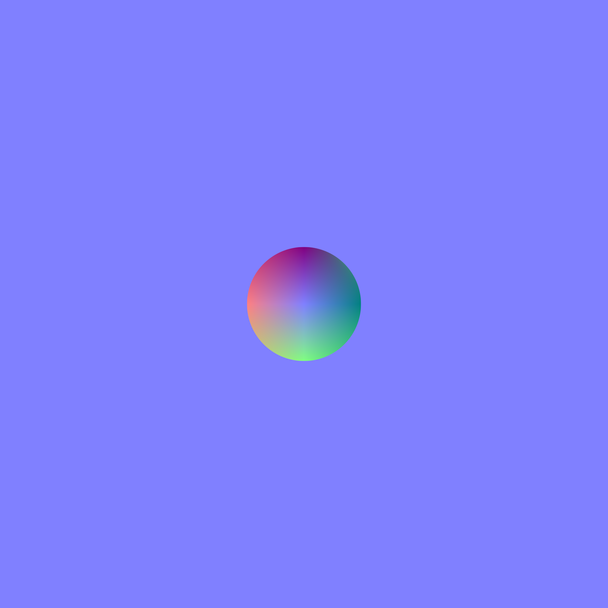
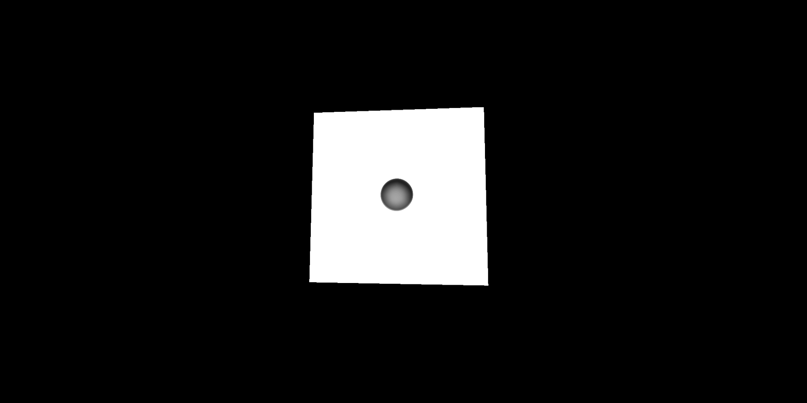

# Activity 6: Normal Maps - Adding contours and depth to 3D Objects
_Pre-requisites: Activity 3_

## Activity Example
- [Activity 6: Normal Maps](../activities/activity6.html)

The spinning die from Activity 3 is definitely pretty fancy; however, it doesn't look too realistic.
Most notably, the images show a curved corner, but the underlying cube structure is still very pointy.
Additionally, each of the dots on the die are flat, instead of bearing a divot like on a normal die.

While rounding off the corners and edges is beyond the scope of this tutorial (see some of the [official examples](https://threejs.org/examples/#webgl_loader_texture_lottie) if you're interested in that), adding the divots for each dot can be accomplished without any third-party 3D modeling tools like [Blender](https://www.blender.org/).

Adding the divots can be accomplished using a normal map, which is a special type of texture where the RGB values of each pixel in the image indicate how light should bounce off of that pixel.
Specifically, the red, green, and blue pixel components respectively correspond to the `x`, `y`, and `z` components of the vector pointing in the direction in which light should bounce off of that pixel of the object.

Below is an example of the normal map for the `1` side of the die.
Notice how the left side of the circle has a strong red color; that tells `THREE.js` to bounce light off to the right towards the center of the divot.
Conversely, on the right side of the circle the red component is completely absent; that tells `THREE.js` to bounce light back to the left, again towards the center of the divot. 
The same holds true for the strong green at the bottom and the complete lack of green at the top.
The gradient in the colors ensures a smooth transition between those extremes which creates the appearance of a divot in the rendered cube.
The rest of the lavender background tells light to bounce directly off of the surface just like normal.

_This particular normal map was created using [Inkscape](https://inkscape.org/)'s [Mesh Gradient Tool](https://www.youtube.com/watch?v=YdqndZ6T3MA) using color codes shown in [this tutorial by Dreamlight](https://dreamlight.com/how-to-create-normal-maps-from-photographs/). The creation of more sophisticated normal maps is beyond the scope of this tutorial._

The final step of applying the normal map to the cube consists of adding a `normalMap` attribute to the object used to create the `MeshStandardMaterial` for each face of the die as shown in the following code.

```javascript
const material = new THREE.MeshFaceMaterial([
  new THREE.MeshStandardMaterial( { 
    map: THREE.ImageUtils.loadTexture('img/1.png'),
    normalMap: THREE.ImageUtils.loadTexture('img/1n.png'),
  } ),
  new THREE.MeshStandardMaterial( { 
    map: THREE.ImageUtils.loadTexture('img/6.png'),
    normalMap: THREE.ImageUtils.loadTexture('img/6n.png'),
  } ),
  new THREE.MeshStandardMaterial( { 
    map: THREE.ImageUtils.loadTexture('img/2.png'),
    normalMap: THREE.ImageUtils.loadTexture('img/2n.png'),
  } ),
  new THREE.MeshStandardMaterial( { 
    map: THREE.ImageUtils.loadTexture('img/5.png'),
    normalMap: THREE.ImageUtils.loadTexture('img/5n.png'),
  } ),
  new THREE.MeshStandardMaterial( { 
    map: THREE.ImageUtils.loadTexture('img/3.png'),
    normalMap: THREE.ImageUtils.loadTexture('img/3n.png'),
  } ),
  new THREE.MeshStandardMaterial( { 
    map: THREE.ImageUtils.loadTexture('img/4.png'),
    normalMap: THREE.ImageUtils.loadTexture('img/4n.png'),
  } ),
]);
```

You'll notice that the base images for the sides of the die have also been changed to use a dark grey dot instead of solid black and have removed the curved line since we won't be rounding off the corners and edges here.

The use of the dark grey dot allows the shadows created by the normal map to be seen against the color of the divot.

If all went well, then your spinning die should now have shadows on each of the dots which will create the appearance of divots.


At this point, the only thing remaining for the final screensaver is to add the code that animates this spinning die bouncing around the screen.
Go ahead and update your `animate` function with the following code.

```javascript
//////////////////////////////////////////////////
// UPDATED: Create the bouncing cube animation

// NEW: Start the die traveling up and to the right.
let travelX = true;
let travelY = true;

const animate = function () {
  // Set up the recurring call that powers the animation loop
  requestAnimationFrame( animate );

  // Change the rotation of the cube for one frame of animation
  cube.rotation.x += 0.01;
  cube.rotation.z += 0.01;

  // NEW: Bounce the cube from right to left
  travelX = travelX ? cube.position.x < 1.8 : cube.position.x < -1.8;
  cube.position.x += travelX ? 0.01 : -0.01;
  
  // NEW: Bounce the cube from top to bottom
  travelY = travelY ? cube.position.y < 1 : cube.position.y < -1  ;
  cube.position.y += travelY ? 0.01 : -0.01;

  // Redraw the scene in the browser window
  renderer.render( scene, camera );
};

// Start the animation loop
animate();
```

This animation starts by translating the die up and to the right.
However, as soon as the position of the die hits the threshold of one of the edges of the screen the animation flips the direction of translation which creates the appearance of the cube "bouncing" off of that edge of the screen.

If you got it right, you should have your new screensaver!
[](./activity7.md)

If you're having trouble, feel free to reference [`activity6.html`](../activities/activity6.html) to see the final code.


### Applicable Learning Outcomes:
#### Learning Outcome 2: Textures
The student will be able to use THREE.js to add color and images to 3D objects.
#### Learning Outcome 3: Animation
The student will be able to create a basic render loop in THREE.js to create visible animations of 3D objects in the browser window.
#### Learning Outcome 5: Lighting
The student will be able to use THREE.js to create lighting effects on 3D objects moving in the browser window.
#### Learning Outcome 6: Normal Maps
The student will be able to use THREE.js to apply normal maps and depth to 3D objects.
