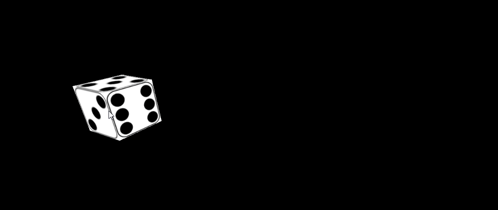

# Tutorial
Learn the basics of `THREE.js`, a beginner-friendly library for performing 3D rendering on the web, by creating a 3D Dice Screensaver 🎲💻!

## Activities

### [Activity 1: Getting Started](./activity1.md)
Learn the fundamental concepts of 3D rendering like scenes, geometries, and meshes to create a basic spinning cube animation.

### [Activity 2: Textures](./activity2.md)
Learn how to attach custom images (i.e. "textures") to 3D objects.

### [Activity 3: Lighting](./activity3.md)
Learn how to add lights to a scene to create a sense of depth and direction.

### [Activity 4: Basic Interactivity](./activity4.md)
Learn the basics of controlling 3D objects with user input.

### [Activity 5: Advanced Interactivity](./activity5.md)
Learn some more advanced techniques for controlling 3D objects with user input.

### [Activity 6: Normal Maps](./activity6.md)
Learn how to apply special textures called normal maps that create the appearance of contours and divots to finish off the re-creation of a classic screensaver, this time with a bouncing 3D die.

